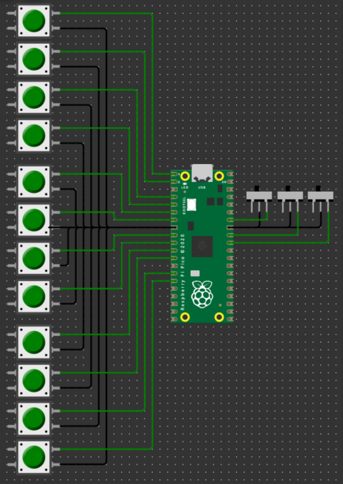

# Pico Deck
Pico Deck is a Raspberry Pi Pico-based USB macro keyboard project.

With the help of CircuitPython and Adafruit's libraries, you can create your own custom keyboard with an anti-ghosting system that can handle up to 12 physical buttons and 3 physical switches to toggle 8 different profiles.

## Features
- Anti-ghosting system
- Use F13 to F24 virtual keyboard keys
- Up to 12 physical buttons
- 3 physical switches (on/off) to toggle 8 different profiles

### Simple profiles
When a button is pressed, instruction `press` and `release` are sent to the computer for each button individually

You can press multiple buttons at the same time with anti-ghosting

### Profiles with macro combination
Instruction `press` and `release` are sent to the computer only when you push the button
You can combine Ctrl, Alt, Shift and F# (in this order) by toggling the switches:
- Ctrl+F#
- Ctrl+Alt+F#
- Ctrl+Alt+Shift+F#
- Ctrl+Shift+F#
- Alt+F#
- Alt+Shift+F#
- Shift+F#

## Installation
### Flash CircuitPython firmware
1. Clone or download this repository.
2. On your Pico, press the BOOTSEL button while plugging it into your computer via USB.
3. Download the [latest CircuitPython firmware](https://circuitpython.org/downloads) file (.uf2).
4. Drag and drop the firmware file on your Pico storage. The Pico will reboot.

### Install code
1. Plug your Pico into your computer (do not press BOOTSEL).
2. Go to the `code` folder.
3. Drag and drop the `code.py` and `lib` folder on your Pico.

### Wiring
- GP0 <-----> F13 Push button <-----> GND
- GP1 <-----> F14 Push button <-----> GND
- GP2 <-----> F15 Push button <-----> GND
- GP3 <-----> F16 Push button <-----> GND
- GP4 <-----> F17 Push button <-----> GND
- GP5 <-----> F18 Push button <-----> GND
- GP6 <-----> F19 Push button <-----> GND
- GP7 <-----> F20 Push button <-----> GND
- GP8 <-----> F21 Push button <-----> GND
- GP9 <-----> F22 Push button <-----> GND
- GP10 <-----> F23 Push button <-----> GND
- GP11 <-----> F24 Push button <-----> GND
- GP28 <-----> Ctrl Switch <-----> GND
- GP27 <-----> Shift Switch <-----> GND
- GP26 <-----> Alt Switch <-----> GND

### Usage
Once you have installed the code and connected the buttons, switches, and Pico as described above, you can start using your macro keyboard.

To use the simple profiles, just press the desired button(s), and the corresponding key(s) will be sent to the computer.

To use the profiles with macro combination, toggle the desired switches and then press the button(s).

The corresponding key(s) and macro(s) will be sent to the computer.

Enjoy your custom macro keyboard!